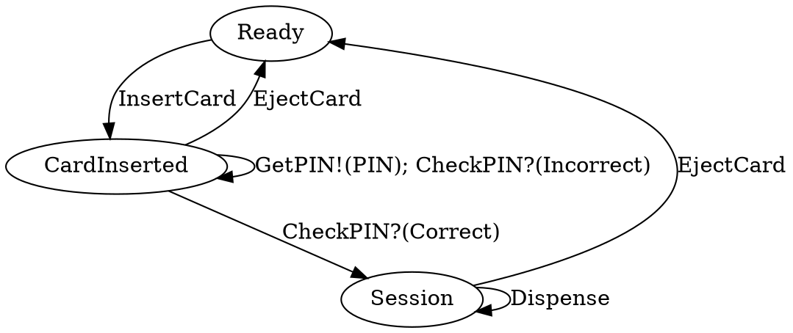
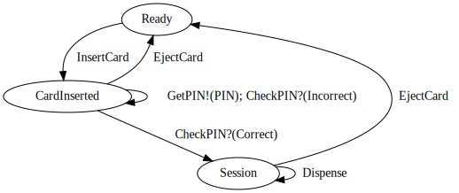

# idris2-dsa-gen

Idris2 code based on Dependent State Automata diagrams.

# What?

If you have followed the Type Driven Development with Idris book, you may have
spotted some patterns in chapter 14 in terms of modelling dependent state
automata in Idris. This project attempts to auto-generate the Idris2 source-code
for these based on a DOT (`.gv`) file.

# Does it work?

Yes! (albeit with some [limitations](#limitations)

Generating Idris source code from `.gv` files is ~~almost~~ done! The
following example (from the TDD book, Ch 14) can be modelled in DOT:



Which means you can generate a graph of the program and its states:


**HOWEVER** you can then _also_ use the DOT-code/-model to generate Idris
through the `toIdris2` function, resulting in the following output:

```bash
$ idris2 -p contrib -p dot-parse DSAGen.idr --exec atmTest
```

```idris


	 -- SUCCESS!!! --


data ATMState
  = Session
  | CardInserted
  | Ready

data CheckPINRes
  = Incorrect
  | Correct

data ATMCmd : (resTy : Type) -> ATMState -> (resTy -> ATMState) -> Type where

  InsertCard : ATMCmd () (Ready) (const (CardInserted))
  GetPIN : ATMCmd () (CardInserted) (const (CardInserted))
  Dispense : ATMCmd () (Session) (const (Session))

  CheckPIN : ATMCmd (CheckPINRes) (CardInserted) (\case (Incorrect) => (CardInserted); (Correct) => (Session))

  EjectCard : ATMCmd () anyState (const (Ready))

  Pure : (res : resTy) -> ATMCmd resTy (state_fn res) state_fn

  (>>=) :  ATMCmd resTy state_1 state2_fn
        -> (contn : (res : resTy) -> ATMCmd cResTy (state2_fn res) state3_fn)
        -> ATMCmd cResTy state_1 state3_fn
```

It is not the prettiest, and [there is some stuff to fill in](#limitations), but
after that it type-checks and you would be able to program parts of Ch 14 using
the result!

# Limitations

There are currently the following limitations to this project:
  - Edge names are assumed to be correct and unique (except for dependent edges,
      where they are expected to match). It is the programmer's/diagram-drawer's
      responsibility to make sure this is true.
  - There is no system/syntax for specifying type information, meaning that
      anything put at the type-level (e.g. in the state of the DSA) gets
      code-generated as holes. If you know the type, this can be solved by
      passing the output through a `sed -e 's/?<var>_hole/<type>/g'` step, but
      this is not ideal.
  - The program does not generate the type of the result of a produce command,
      meaning these need to be filled in manually (e.g. `PIN` in the ATM
      example). This is again not a huge problem, since these tend to be
      type-aliases or similar and so can be quickly defined. But like with the
      missing type information, it is not ideal.

After some experimentation and playing around with more complex DSAs, there
seems to be a limitation to this approach in general, in that the diagrams for
more complex state stop being nice and easily human-readable. One could argue
that we do not need to display everything at once, and whilst that is true,
partial display/hiding is unfortunately not a feature supported by DOT.

# LICENSE

This work is licensed under GPL-2.0.

