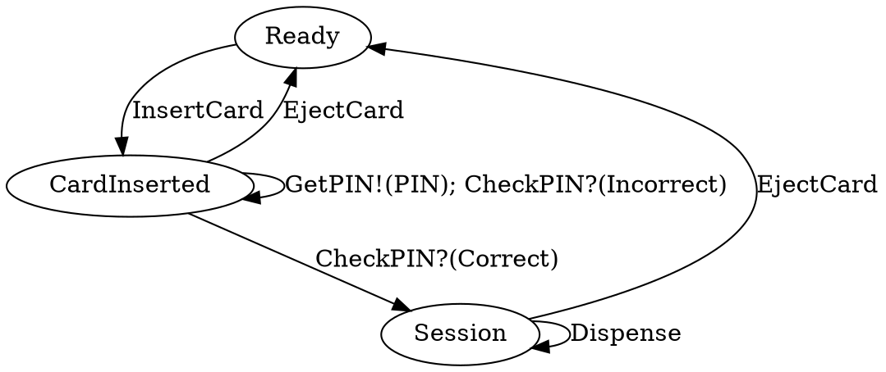

# idris2-dsa-gen

Auto-generating Idris2 code based on Dependent State Automata (DSA) diagrams.


# What?

If you have followed the Type Driven Development with Idris book, you may have
spotted some patterns in chapter 14 in terms of modelling Dependent State
Automata in Idris. This project attempts to auto-generate the Idris2 source-code
for these based on a DOT (`.gv`) file.


# Does it work?

Yes! (albeit with some [limitations](#limitations))

Generating Idris source code from `.gv` files is ~~almost~~ done! The
following example (from the TDD book, Ch 14) can be modelled in DOT:



Which means you can generate a graph of the program and its states:


**HOWEVER** you can then _also_ use the DOT-code/-model to generate Idris
through the `toIdris2` function, resulting in the following output:

```bash
$ idris2 -p contrib -p dot-parse DSAGen.idr --exec atmTest
```

```idris


	 -- SUCCESS!!! --


data ATMState
  = Session
  | CardInserted
  | Ready

data CheckPINRes
  = Incorrect
  | Correct

data ATMCmd : (resTy : Type) -> ATMState -> (resTy -> ATMState) -> Type where

  InsertCard : ATMCmd () (Ready) (const (CardInserted))
  GetPIN : ATMCmd () (CardInserted) (const (CardInserted))
  Dispense : ATMCmd () (Session) (const (Session))

  CheckPIN : ATMCmd (CheckPINRes) (CardInserted) (\case (Incorrect) => (CardInserted); (Correct) => (Session))

  EjectCard : ATMCmd () anyState (const (Ready))

  Pure : (res : resTy) -> ATMCmd resTy (state_fn res) state_fn

  (>>=) :  ATMCmd resTy state_1 state2_fn
        -> (contn : (res : resTy) -> ATMCmd cResTy (state2_fn res) state3_fn)
        -> ATMCmd cResTy state_1 state3_fn
```

It is not the prettiest, and [there is some stuff to fill in](#limitations), but
after that it type-checks and you would be able to program parts of Ch 14 using
the result!


# How does it work?

In a nutshell: DOT/GraphViz diagrams are annotated with special syntax (using
DOT's built-in `label`s), the result is then parsed and turned into a Domain
Specific Language (DSL) which describes Dependent State Automata (DSA). From
this DSA representation, the Idris2 code is then generated.

## Syntax

The DOT edge labels can use the following syntax to describe what the
edge/command does (if anything):

  - `:(<val>)` -- specifies a value which the command takes as an argument.
  - `?(<case_val>)` -- specifies a value which is a case in a dependent result
      (e.g. the `CheckPIN` result in the ATM) and indicates that the edge only
      connects these states when this case is hit.
  - `!(<val>)` -- specifies a value which the command produces as a result.

Currently, the following types of values are supported:

  - Idris names, e.g. `sn`,
  - Integer literals,
  - Data constructors (including ones with arguments!),
  - Addition of two sub-values,
  - Tuples of values.

## Code generation

The complete process for code generation (cg) is as follows:

  1. The special DOT/GraphViz file is parsed by the
       [`dot-parse`](https://github.com/CodingCellist/idris2-dot-parse)
       package.
  2. The AST is then converted to a DSA `DSLv2`, in part by the parsers found in
       `src/DSAGen/Parser/`. This DSL stores:
     - Stores the DSA's name `dsaName`,
     - extracts the states,
     - extracts _all_ the edges,
     - filters and combines the Universal Edges from all the edges,
     - splits the remaining edges using the `Split` data-structure and the
         `IsPlainEdge` proof, to separate the plain from the syntax-dependent
         edges.
  3. The states get cg-ed to a top-level type declaration with constructors for
       each state name.
  4. The results of dependent edges get cg-ed to top-level type declarations
       with constructors.
     - As part of this process, the non-plain-non-dependent edges get `split`
         off as well. This allows for easier cg since we don't have to worry
         about being handed an edge which isn't dependent.
     - All the dependent edges are then accumulated based on their command/edge
         name. This is to gather all the possible results/cases in one
         data-structure for easier cg.
     - For each of the types of dependent edges (i.e. dep, take-dep, dep-prod,
         and take-dep-prod), a data declaration with constructors is then
         generated (note: only dep-edges at the moment; see
         [limitations](#limitations)).
  5. The DSA command (cmd) data declaration gets cg-ed.
  6. The commands/edges get cg-ed
     - First the plain edges are cg-ed.
     - Then the non-plain edges are paired with their proofs of non-plainness,
     - and are then `split` again along a proof for non-plain-non-dependentness.
     - From this split, the non-plain-non-dependent edges get cg-ed,
     - And finally, the non-plain-dependent edges get cg-ed
       * Only simple dependent edges are currently supported; see
           [limitations](#limitations).
  7. Universal Edges get cg-ed.
     - These are each a plain command producing no result, and going from
         `anyState` back to a single state.
  8. Finally, the `Pure` and `(>>=)` (read: 'bind') commands get cg-ed.
     - These have exactly the same structure for all DSAs, with the exception of
         the name of the command-type/DSA they belong to.


# Limitations

There are currently the following limitations to this project:

  - The Idris2 code is generated through magic strings rather than elaborator
      reflection, meaning that there are no guarantees that the resulting Idris
      is valid. I have taken _extreme_ care in crafting these magic strings, but
      there may be issues (please let me know if so!).
  - Edge names are assumed to be correct and unique (except for dependent edges,
      where they are expected to match). It is the programmer's/diagram-drawer's
      responsibility to make sure this is true.
  - There is no system/syntax for specifying type information, meaning that
      anything put at the type-level (e.g. in the state of the DSA) gets
      code-generated as holes. If you know the type, this can be solved by
      passing the output through a `sed -e 's/?<var>_hole/<type>/g'` step, but
      this is not ideal.
  - The program does not generate the type of the result of a produce command,
      meaning these need to be filled in manually (e.g. `PIN` in the ATM
      example). This is again not a huge problem, since these tend to be
      type-aliases or similar and so can be quickly defined. But like with the
      missing type information, it is not ideal.
  - Only simple dependent edges are supported. The rest will hit holes and exit
      with an error saying so. This is due to the general limitation described
      below.

After some experimentation and playing around with more complex DSAs, there
seems to be a limitation to this approach in general, in that the diagrams for
more complex state stop being nice and easily human-readable. One could argue
that we do not need to display everything at once, and whilst that is true,
partial display/hiding is unfortunately not a feature supported by DOT.


# LICENSE

This work is licensed under GPL-2.0.

