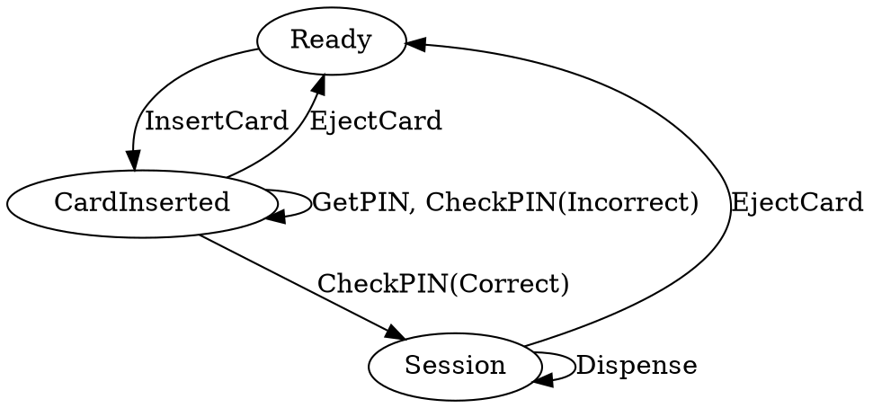
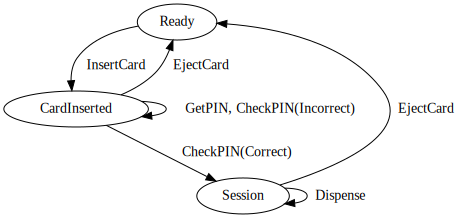

# idris2-dsa-gen
Idris2 code based on Dependent State Automata diagrams.

# What?
If you have followed the Type Driven Development with Idris book, you may have
spotted some patterns in chapter 14 in terms of modelling dependent state
automata in Idris. This project attempts to auto-generate the Idris2 source-code
for these based on a DOT (`.gv`) file.

# Does it work?

Yes! Generating Idris source code from `.gv` files is ~~almost~~ done! The
following example (from the TDD book, Ch 14) can be modelled in DOT:



Which means you can generate a graph of the program and its states:


**HOWEVER** you can then _also_ use the DOT-code/-model to generate Idris
through the (currently unsafe) `unsafeGenIdris` function, resulting in the
following output:

```bash
$ idris2 -p contrib -p dot-parse DSAGen.idr --exec fullATMTest
```

```idris
-- /!\ UNSAFELY GENERATED /!\ -- 

data ATMState = Session | CardInserted | Ready

data CheckPINRes = Incorrect | Correct

data ATMCmd : (ty : Type)  -> ATMState -> (ty -> ATMState) -> Type where

  EjectCard : ATMCmd () anyState (const Ready)
  InsertCard : ATMCmd () Ready (const CardInserted)
  GetPIN : ATMCmd () CardInserted (const CardInserted)
  Dispense : ATMCmd () Session (const Session)


  CheckPIN : ATMCmd CheckPINRes CardInserted (\depRes => case depRes of Incorrect => CardInserted; Correct => Session)


  Pure : (res : ty) -> ATMCmd ty (state_fn res) state_fn

  (>>=) :  ATMCmd a state1 state2_fn
        -> ((res : a) -> ATMCmd b (state2_fn res) state3_fn)
        -> ATMCmd b state1 state3_fn
```

It is not the prettiest, but it type-checks and you would be able to program
parts of Ch 14 using the result!

# LICENSE
This work is licensed under GPL-2.0.

